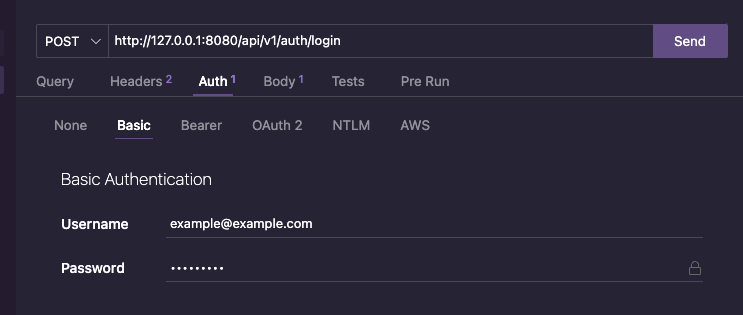

# Patch User By Id

## Endpoints

### `POST /auth/login`

Login the user. This method requires the username and password to be sent via Authorization header, using basic auth. In Thunder Client is sent like this:


Note: In the username field in the Header, you can send either the username of the email of the user

Test users:

- username: "john-doe",
- password: "Admin123\*"

- username: "jane-doe",
- password: "Admin123\*"

- username: "erick.salas",
- password: "Admin123\*"

- username: "caroline_richards",
- password: "Admin123\*"

- username: "anna.watts",
- password: "Admin123\*"

### Parameters

- N/A

### Response

Returns a JSON object with the following properties:

#### Success

- `message`: Success message
- `user`: Authenticated user, including `id`, `username`, `name`, `email`, `role.id` and `role.title`

#### Failure

- `error`: Error message, or array with one or more error objects, each with an error message `msg`

### Example

Request:

```
POST /auth/login
```

Authorization header:

```json
{
  "username": "Charlotte_Williams",
  "password": "Charlotte123*"
}
```

Response:

Response code: 200

```json
{
  "message": "User logged in succesfully",
  "user": {
    "id": 9,
    "username": "Charlotte_Williams",
    "name": "Charlotte Williams",
    "email": "charlotte@gmail.com",
    "role": {
      "id": 2,
      "title": "chef"
    }
  }
}
```

## Errors

This API uses the following error codes:

- `400 Bad Request`: The request was malformed or missing required parameters.
- `401 Unauthorized`: The credentials provided were invalid or missing.
- `404 Not Found`: The requested resource was not found.
- `500 Internal Server Error`: An unexpected error occurred on the server.
